# my-component

<!-- Auto Generated Below -->

## Dependencies

### Depends on

- [s-viskhan-header](../s-viskhan-header)
- [s-viskhan-news-post](../s-viskhan-news-post)
- [s-viskhan-new-blog-posts](../s-viskhan-new-blog-posts)
- [s-viskhan-popular](../s-viskhan-popular)
- [s-viskhan-events](../s-viskhan-events)
- [s-viskhan-test-drive](../s-viskhan-test-drive)
- [s-viskhan-second](../s-viskhan-second)
- [s-viskhan-erik](../s-viskhan-erik)
- [s-viskhan-articles](../s-viskhan-articles)
- [s-viskhan-froala](../s-viskhan-froala)
- [s-viskhan-footer](../s-viskhan-footer)

### Graph

```mermaid
graph TD;
  my-component --> s-viskhan-header
  my-component --> s-viskhan-news-post
  my-component --> s-viskhan-new-blog-posts
  my-component --> s-viskhan-popular
  my-component --> s-viskhan-events
  my-component --> s-viskhan-test-drive
  my-component --> s-viskhan-second
  my-component --> s-viskhan-erik
  my-component --> s-viskhan-articles
  my-component --> s-viskhan-froala
  my-component --> s-viskhan-footer
  s-viskhan-news-post --> s-viskhan-news-sidebar
  s-viskhan-news-post --> s-viskhan-new-blog
  s-viskhan-new-blog-posts --> s-viskhan-item-blog
  s-viskhan-popular --> s-viskhan-item-pop
  s-viskhan-events --> s-viskhan-item-events
  s-viskhan-test-drive --> s-viskhan-item-drive
  s-viskhan-second --> s-viskhan-continue
  s-viskhan-erik --> s-viskhan-item-erik
  s-viskhan-articles --> s-viskhan-item-articles
  s-viskhan-froala --> s-viskhan-news
  s-viskhan-froala --> s-viskhan-home
  style my-component fill:#f9f,stroke:#333,stroke-width:4px
```

----------------------------------------------

*Built with [StencilJS](https://stenciljs.com/)*
