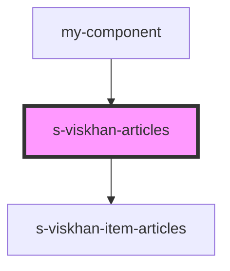

# s-viskhan-articles

<!-- Auto Generated Below -->

## Properties

| Property      | Attribute      | Description | Type  | Default     |
| ------------- | -------------- | ----------- | ----- | ----------- |
| `forArticles` | `for-articles` |             | `any` | `undefined` |

## Dependencies

### Used by

 - [my-component](../my-component)

### Depends on

- [s-viskhan-item-articles](./res/view/s-viskhan-item-articles)

### Graph

----------------------------------------------

*Built with [StencilJS](https://stenciljs.com/)*
