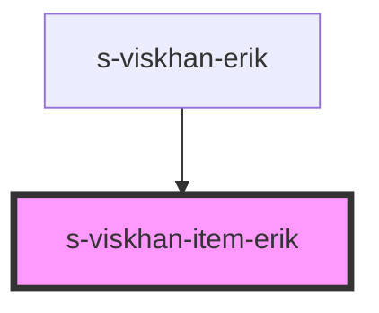

# s-viskhan-item-erik

<!-- Auto Generated Below -->

## Properties

| Property  | Attribute  | Description | Type  | Default     |
| --------- | ---------- | ----------- | ----- | ----------- |
| `forErik` | `for-erik` |             | `any` | `undefined` |

## Dependencies

### Used by

 - [s-viskhan-erik](../../..)

### Graph

----------------------------------------------

*Built with [StencilJS](https://stenciljs.com/)*
