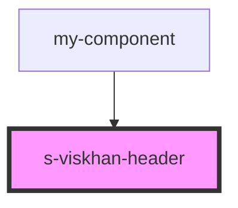

# s-viskhan-header

<!-- Auto Generated Below -->

## Properties

| Property    | Attribute    | Description          | Type                   | Default     |
| ----------- | ------------ | -------------------- | ---------------------- | ----------- |
| `forHeader` | `for-header` | Массив для Header    | `any`                  | `undefined` |
| `header`    | --           | Интерфейс для Header | `SViskhanHeaderItem[]` | `[]`        |

## Events

| Event                        | Description              | Type               |
| ---------------------------- | ------------------------ | ------------------ |
| `clickHeaderArticles`        | Клик по Articles         | `CustomEvent<any>` |
| `clickHeaderButton`          | Клик по Button           | `CustomEvent<any>` |
| `clickHeaderCustomerStories` | Клик по Customer Stories | `CustomEvent<any>` |
| `clickHeaderEvents`          | Клик по Articles         | `CustomEvent<any>` |
| `clickHeaderIcon`            | Клик по Icon             | `CustomEvent<any>` |
| `clickHeaderImg`             | Клик по картинке         | `CustomEvent<any>` |
| `clickHeaderInput`           | Клик по Input            | `CustomEvent<any>` |
| `clickHeaderReports`         | Клик по Reports          | `CustomEvent<any>` |
| `clickHeaderWibbitz`         | Клик по wibbitz          | `CustomEvent<any>` |

## Dependencies

### Used by

 - [my-component](../my-component)

### Graph

----------------------------------------------

*Built with [StencilJS](https://stenciljs.com/)*
