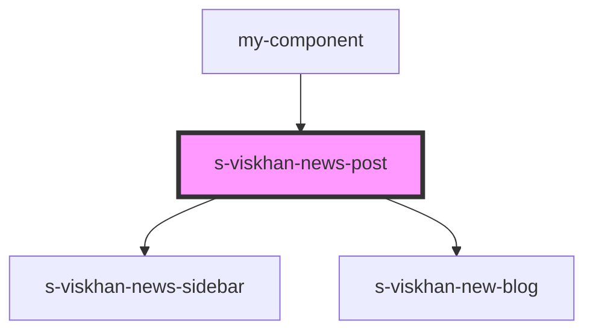

# s-viskhan-news-post

<!-- Auto Generated Below -->

## Properties

| Property     | Attribute      | Description | Type  | Default     |
| ------------ | -------------- | ----------- | ----- | ----------- |
| `forNewBlog` | `for-new-blog` |             | `any` | `undefined` |
| `forSidebar` | `for-sidebar`  |             | `any` | `undefined` |

## Dependencies

### Used by

 - [my-component](../my-component)

### Depends on

- [s-viskhan-news-sidebar](./res/view/s-viskhan-news-sidebar)
- [s-viskhan-new-blog](./res/view/s-viskhan-new-blog)

### Graph

----------------------------------------------

*Built with [StencilJS](https://stenciljs.com/)*
