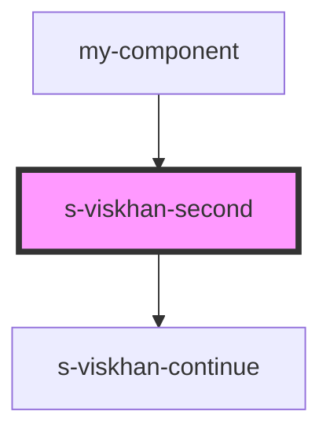

# s-viskhan-second

<!-- Auto Generated Below -->

## Properties

| Property      | Attribute      | Description | Type  | Default     |
| ------------- | -------------- | ----------- | ----- | ----------- |
| `forContinue` | `for-continue` |             | `any` | `undefined` |

## Dependencies

### Used by

 - [my-component](../my-component)

### Depends on

- [s-viskhan-continue](./res/view/s-viskhan-continue)

### Graph

----------------------------------------------

*Built with [StencilJS](https://stenciljs.com/)*
