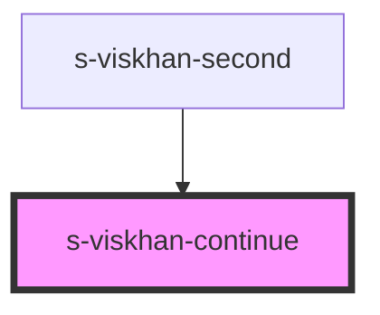

# s-viskhan-continue

<!-- Auto Generated Below -->

## Properties

| Property      | Attribute      | Description | Type  | Default     |
| ------------- | -------------- | ----------- | ----- | ----------- |
| `forContinue` | `for-continue` |             | `any` | `undefined` |

## Dependencies

### Used by

 - [s-viskhan-second](../../..)

### Graph

----------------------------------------------

*Built with [StencilJS](https://stenciljs.com/)*
